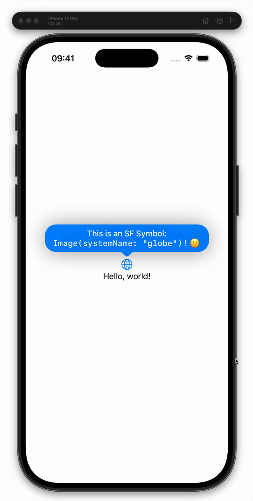
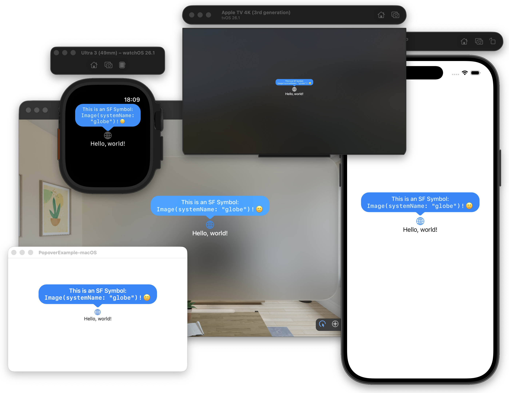
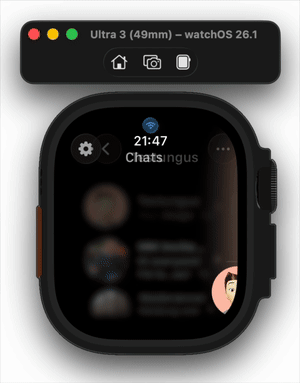
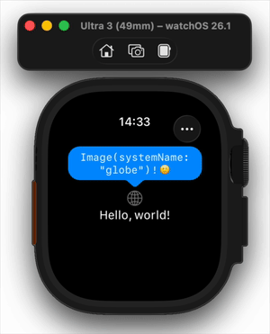

# SwiftUI Popover



Lightweight, SwiftUI-only, composable popovers. Attach any custom popover view to any other view deep in your view hierarchy.
No UIKit-based hacks. Works across all SwiftUI platforms.

> Popovers are rendered exactly where you opt in with `.presentPopovers()`, so they are easy to embed inside sheets, navigation stacks, or feature modules.

### Features

- **SwiftUI-only** – Implemented entirely with SwiftUI layout, anchors, and geometry.
- **Composable and scoped** – Popovers exist only inside the view subtree where you call `.presentPopovers()`.
- **Anchored with arrow** – Arrow follows the effective attachment point of the popover.
- **Cross-platform** – Designed to run on iOS, macOS, watchOS, tvOS, and visionOS.
- **Configurable dismissal** – Optional dimming and tap/drag-to-dismiss behavior.
- **Multiple popovers** – Support for multiple popovers, with an option to make a popover "exclusive".

<br clear="right" />

---



## Requirements

- Swift 6 (Swift tools version 6.0) or newer
- Xcode 16 or newer
- Platforms:
  - iOS 16+
  - macOS 14+
  - watchOS 11+
  - tvOS 18+
  - visionOS 1+

Adjust the platforms in `Package.swift` as needed.

---

## Installation

### Swift Package Manager (Xcode)

1. In Xcode, open your project.
2. Go to **File → Add Packages…**
3. Enter the repository URL, for example:

   ```
   https://github.com/qusc/SwiftUI-Popover.git
   ```

4. Add the **SwiftUI-Popover** product to your app target.

Then:

```swift
import SwiftUI
import SwiftUI_Popover
```

The Swift Package product is named `SwiftUI-Popover`, and the module you import in Swift code is `SwiftUI_Popover`.

---

## Basic usage

Wrap the part of your view hierarchy that should be able to show popovers in `.presentPopovers()`, and attach popovers with `.swiftUIPopover`.

```swift
import SwiftUI
import SwiftUI_Popover

struct ContentView: View {
    @State private var isPopoverPresented = true
    @GestureState private var dragOffset: CGSize = .zero

    var body: some View {
        VStack {
            Image(systemName: "globe")
                .imageScale(.large)
                .foregroundStyle(.tint)
                // Attach the popover to this view
                .swiftUIPopover(
                    isPresented: $isPopoverPresented,
                    preferredAttachmentEdge: .top
                ) {
                    PopoverMessageBubble(fill: Color.blue) {
                        Text("SwiftUI-only popover attached to\n`Image(systemName: \"globe\")`.")
                            .foregroundStyle(.white)
                            #if os(watchOS)
                            .font(.system(size: 14))
                            #endif
                    }
                    .shadow(radius: 20)
                }

            Text("Hello, world!")
        }
        // Optional: draggable demo with a spring snap-back
        .offset(x: dragOffset.width, y: dragOffset.height)
        .animation(
            .spring(response: 0.35, dampingFraction: 0.7, blendDuration: 0),
            value: dragOffset
        )
        #if !os(tvOS)
        .gesture(
            DragGesture()
                .updating($dragOffset) { value, state, _ in
                    state = value.translation
                }
        )
        #endif
        .frame(maxWidth: .infinity, maxHeight: .infinity)
        // Install the popover presentation layer for this subtree
        .presentPopovers()
        #if !os(watchOS)
        .padding(4)
        #endif
    }
}
```

See the example app in the `Example/` directory.

## Real-world example

A short clip from a production app using `SwiftUI-Popover`:



## Toolbar menu example

You can also use `SwiftUI-Popover` to build lightweight toolbar menus – including on watchOS, where SwiftUI's built-in `Menu` is not available.



Example toolbar integration:

```swift
import SwiftUI_Popover
import SwiftUI

struct ToolbarMenuExample: View {
    @State private var showToolbarMenu = false
    
    var body: some View {
        NavigationStack {
            Text("Toolbar menu example")
                .navigationTitle("Inbox")
                .toolbar {
                    #if os(watchOS)
                    let placement: ToolbarItemPlacement = .topBarTrailing
                    #else
                    let placement: ToolbarItemPlacement = .automatic
                    #endif
                    
                    ToolbarItem(placement: placement) {
                        Button {
                            withAnimation { showToolbarMenu = true }
                        } label: {
                            Image(systemName: "ellipsis")
                        }
                        .swiftUIPopover(
                            isPresented: $showToolbarMenu,
                            disableDelay: true,
                            isExclusive: true,
                            isDismissible: true
                        ) {
                            PopoverMessageBubble(fill: .clear, enableGlassEffect: true) {
                                VStack(alignment: .leading) {
                                    Group {
                                        Button("Lightning", systemImage: "bolt.fill", action: { })
                                        Button("Sleep", systemImage: "moon.fill", action: { })
                                    }
                                    .padding()
                                }
                            }
                        }
                    }
                }
        }
        .presentPopovers()
    }
}
```

The included example project also features a toolbar menu and demonstrates the coordination of 
multiple popovers.

---

## API overview

### 1. Attaching a popover

```swift
swiftUIPopover(
    isPresented: Binding<Bool>,
    disableDelay: Bool = false,
    isExclusive: Bool = false,
    isDismissible: Bool = false,
    preferredAttachmentEdge: VerticalEdge? = nil,
    @ViewBuilder content: () -> some View
)
```

- `isPresented` – Controls visibility of this popover.
- `disableDelay` – Show immediately instead of delaying the initial appearance (if you want).
- `isExclusive` – If `true`, this popover hides others while it is visible.
- `isDismissible` – If `true`, a dimming background is added and tapping / dragging it dismisses the popover.
- `preferredAttachmentEdge` – Force the popover to attach to `.top` or `.bottom`. If `nil`, the library picks an edge based on available space.

Example:

```swift
Button("Show details") {
    isPopoverPresented.toggle()
}
.swiftUIPopover(
    isPresented: $isPopoverPresented,
    isDismissible: true,
    isExclusive: true,
    preferredAttachmentEdge: .top
) {
    PopoverMessageBubble(fill: Color(.systemBackground)) {
        Text("Details about this button.")
    }
}
```

### 2. Installing the presentation layer

```swift
presentPopovers(padding: EdgeInsets? = nil)
```

Call this once on the container where you want popovers to be rendered. This prevents popovers from propagating to other calls of `presentPopovers(padding:)` at higher levels in the view hierarchy.

```swift
VStack {
    // content that uses `.swiftUIPopover`
}
.presentPopovers()
```

Popovers are drawn in a single overlay relative to this container, not globally at the window level.

---

## `PopoverMessageBubble`


`PopoverMessageBubble` is generic over two `ShapeStyle` types for its fills:

```swift
public struct PopoverMessageBubble<Content: View, F: ShapeStyle, S: ShapeStyle>: View { ... }
```

`PopoverMessageBubble` is a reusable bubble + arrow container for your popover content.

Conceptually:

- Renders a rounded rectangle with an arrow.
- Positions the arrow along the edge based on an effective attachment point.
- Applies platform-specific padding so content looks right on watchOS and other platforms.

Public initializer:

```swift
public init(
    showArrow: Bool = true,
    fill: F,
    secondaryFill: S? = nil,
    enableGlassEffect: Bool = false,
    padding: EdgeInsets = PopoverConstants.defaultPadding,
    @ViewBuilder content: @escaping () -> Content
)
```

Parameters:

- `showArrow` – Whether to draw the arrow or render a plain rounded rectangle.
- `fill` – Primary background `ShapeStyle` for the bubble.
- `secondaryFill` – Optional secondary `ShapeStyle` layered on top (e.g. to combine `Material` with a `Color`).
- `enableGlassEffect` – Enables an optional glassy material effect inside the bubble.
- `padding` – Insets applied to the popover content inside the bubble.

Typical usage:

```swift
PopoverMessageBubble(fill: Color.blue) {
    VStack(alignment: .leading, spacing: 4) {
        Text("Popover title")
            .font(.headline)
        Text("Some additional information goes here.")
            .font(.subheadline)
    }
    .foregroundStyle(.white)
}
.shadow(radius: 16)
```

You can also control padding and secondary fill (e.g. to combine `Material.regular` with another semi-transparent `Color`).

---

## Why not just use SwiftUI’s built-in .popover modifier?

The built-in `.popover` modifier is great on iPadOS and macOS, but:

- Popovers are not available on watchOS.
- On iPhone (compact width), `.popover` often adapts into a sheet or full-screen presentation instead of staying as an anchored bubble.
- The presentation is global and harder to scope to a specific subtree or feature module.
- Arrow placement and appearance are controlled by the system.

This library focuses on:

- A small, composable primitive for anchored popovers.
- Predictable behavior across platforms and size classes.
- Full control over layout and styling in pure SwiftUI.

---

## How it works

Implementation details, in case you are curious:

- Uses `Anchor<CGRect>` and a `PreferenceKey` to collect popover anchors from the view hierarchy.
- The `presentPopovers` modifier reads all popover preferences and renders them in a single overlay.
- `onGeometryChange` is used to measure content size, which is combined with:
  - The anchor rect of the source view.
  - The container frame.
- The library computes an ideal frame for the popover, clamps it to the available bounds, and derives an effective attachment point used to position the arrow.
- The arrow is a custom SwiftUI `Shape` that tracks this attachment point along the edge.

---

## Example project

The repository contains an example app in the `Example/` directory that demonstrates:

- Basic anchored popovers attached to a symbol.
- Draggable content view (on non-tvOS platforms) to visualize how the arrow tracks the attachment point.
- watchOS support and tvOS-specific behavior (tap-to-dismiss instead of drag).

Open the example Xcode project, select a target (iOS, watchOS, etc.), and run.

---

## License

This project is licensed under the MIT License. See the [`LICENSE`](LICENSE) file for details.
